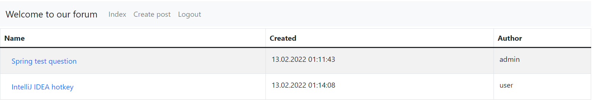
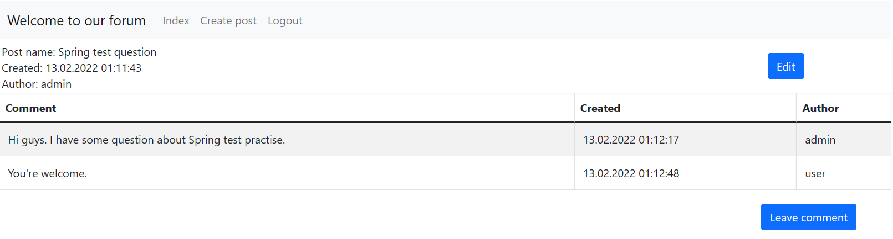

# job4j_forum

It is a simple forum application.

Anonymous user can view all posts and comments.

Registered user can create posts, edit/delete his own posts, leave new comments

and edit/delete his own comments left earlier.

Admin user can create posts, edit/delete all posts, edit his own comments and delete all comments. 

Main page.

Some post page.

Add post page.

Edit post page.

Successful post modification.

Failed post modification.

Add comment page.

Login page.

Registrtion page.

