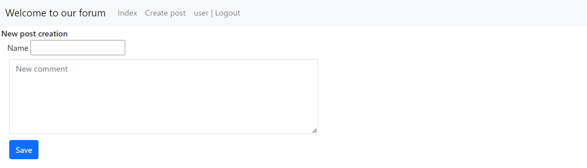
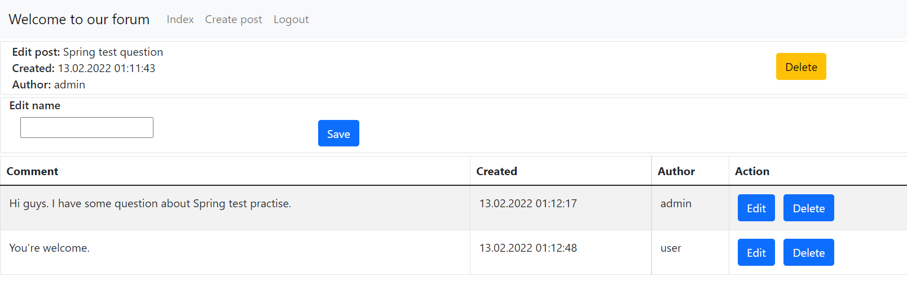
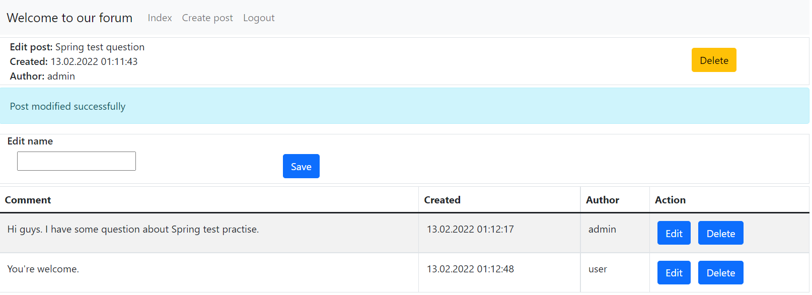
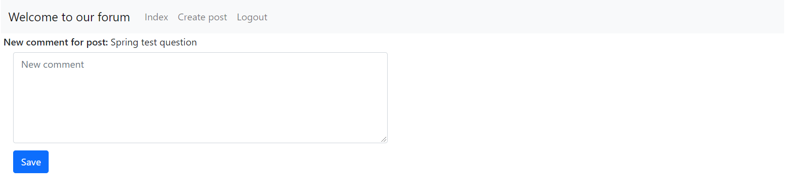

# job4j_forum
## About
It is a simple forum application based on Spring Boot.

Anonymous user can view all posts and comments.

Registered user can create posts, edit/delete his own posts, leave new comments

and edit/delete his own comments left earlier.

Admin user can create posts, edit/delete all posts, edit his own comments and delete all comments. 

## Overview
Main page.

Some post page.

Add post page.

Edit post page.

Successful post modification.

Failed post modification.

Add comment page.

Login page.

Registrtion page.

## Configuration and building

Application configuration resides in /src/main/resources/application.properties file.

You can build the application with command: mvn package.

Before launching the application you must configure your database server according to 

application.properties.

## Contacts

Email: kostasc@mail.ru
Telegram: @rkostashchuk